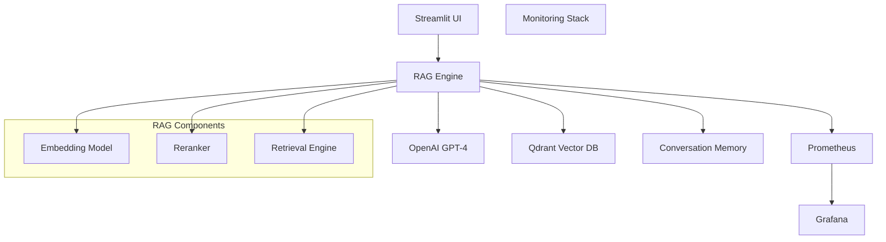

# PDF Chatbot RAG Service

A production-ready Retrieval-Augmented Generation (RAG) chatbot service that enables conversational question-answering over PDF documents. Built with LangChain, OpenAI, Qdrant vector database, and Streamlit for an intuitive user interface.

The RAG system in the project import a config file from another project: https://github.com/shawnzdeng/PDF-chatbot-RAG-processor

## 🌟 Features

- **Document-based Conversations**: Chat with your PDF documents using natural language
- **Advanced RAG Pipeline**: Sophisticated retrieval and generation with reranking capabilities
- **Conversation Memory**: Maintains context across multiple exchanges for natural dialogue
- **Vector Search**: Powered by Qdrant for efficient similarity search and retrieval
- **Real-time Monitoring**: Comprehensive observability with Prometheus and Grafana
- **Production Ready**: Containerized deployment with Kubernetes support
- **Scalable Architecture**: Multi-stage Docker builds and resource optimization

## 🚀 Quick Start

### Prerequisites

- Docker Desktop with Kubernetes enabled
- OpenAI API key
- Qdrant Cloud account (or local Qdrant instance)
- Python 3.10+ (for local development)

### 1. Environment Setup

```bash
git clone https://github.com/your-username/PDF-chatbot-RAG-service.git
cd PDF-chatbot-RAG-service

# Copy and configure environment variables
cp .env.example .env
```

Edit `.env` with your credentials:
```env
OPENAI_API_KEY=your-openai-api-key
QDRANT_URL=https://your-cluster.qdrant.io:6333
QDRANT_API_KEY=your-qdrant-api-key
```

### 2. Local Development

#### Using Docker Compose (Recommended)
```bash
# Start all services
docker-compose up -d

# View logs
docker-compose logs -f rag-chatbot

# Access the application
# RAG Chatbot: http://localhost:8501
# Grafana: http://localhost:3000 (admin/admin)
# Prometheus: http://localhost:9090
```

#### Using Python Directly
```bash
# Install dependencies
pip install -r requirements.txt

# Run the Streamlit app
python -m streamlit run src/ui/streamlit_app.py
```

### 3. Production Deployment

#### Using Minikube (Kubernetes)

**Windows PowerShell:**
```powershell
# Start Minikube
minikube start --driver=docker --memory=8192 --cpus=4

# Deploy the entire stack
.\deploy.ps1

# Check deployment status
kubectl get pods -n rag-system
```

**Linux/macOS:**
```bash
# Start Minikube
minikube start --driver=docker --memory=8192 --cpus=4

# Deploy the stack
chmod +x deploy.sh
./deploy.sh

# Check deployment
kubectl get pods -n rag-system
```

## 🏗️ Architecture



### Core Components

1. **RAG Engine** (`src/rag_engine/`):
   - **QdrantRAG**: Main RAG orchestrator with conversation memory
   - **Conversation Memory**: Context-aware dialogue management
   - **Reranker**: Advanced relevance scoring and hybrid search

2. **User Interface** (`src/ui/`):
   - **Streamlit App**: Interactive chat interface
   - Real-time conversation display
   - Document upload and management

3. **Monitoring** (`src/monitoring/`):
   - **Health Checks**: System health monitoring
   - **Metrics Collection**: Custom RAG metrics and system metrics
   - **Performance Tracking**: Response times and error rates

## 📊 Monitoring & Observability

### Metrics Dashboard

The service includes a comprehensive monitoring stack:

- **Request Metrics**: Total requests, response times, error rates
- **RAG Operations**: Embedding operations, retrievals, generations
- **System Metrics**: CPU, memory, disk usage via Node Exporter
- **Business Metrics**: Active sessions, document processing stats

### Accessing Monitoring

After deployment:

1. **Grafana Dashboard**: 
   - URL: `http://grafana.local` (or via port-forward)
   - Credentials: `admin/admin`
   - Pre-configured RAG System dashboard with 15+ panels

2. **Prometheus Metrics**: 
   - URL: `http://localhost:9090` (via port-forward)
   - Query interface for custom metrics exploration

### Key Metrics

```promql
# Example Prometheus queries
rag_requests_total                    # Total RAG requests
rag_request_duration_seconds         # Request latency
rag_embeddings_total                 # Embedding operations
rag_retrievals_total                 # Document retrievals
rag_errors_total                     # Error counting
```

## ⚙️ Configuration

### Environment Variables

| Variable | Description | Default | Required |
|----------|-------------|---------|----------|
| `OPENAI_API_KEY` | OpenAI API key for LLM | - | ✅ |
| `QDRANT_URL` | Qdrant cluster URL | `http://localhost:6333` | ✅ |
| `QDRANT_API_KEY` | Qdrant API key | - | ✅ |
| `RAG_COLLECTION_NAME` | Qdrant collection name | `rag_collection` | ❌ |
| `EMBEDDING_MODEL` | OpenAI embedding model | `text-embedding-3-large` | ❌ |
| `LLM_MODEL` | OpenAI chat model | `gpt-4o` | ❌ |
| `CHUNK_SIZE` | Document chunk size | `500` | ❌ |
| `TOP_K_RETRIEVAL` | Number of docs to retrieve | `5` | ❌ |

### Advanced Configuration

The service supports production configuration files in `production_config/`:

```json
{
  "rag_config": {
    "chunk_size": 500,
    "chunk_overlap": 100,
    "embedding_model": "text-embedding-3-large",
    "llm_model": "gpt-4o",
    "temperature": 0.0,
    "top_k_retrieval": 5
  },
  "reranker_config": {
    "enabled": true,
    "embedding_weight": 0.3,
    "cross_encoder_weight": 0.7,
    "model": "cross-encoder/ms-marco-MiniLM-L-6-v2"
  }
}
```

## 🔧 Development

### Project Structure

```
PDF-chatbot-RAG-service/
├── src/
│   ├── rag_engine/           # Core RAG logic
│   ├── ui/                   # Streamlit interface
│   └── monitoring/           # Health and metrics
├── k8s/                      # Kubernetes manifests
├── monitoring/               # Prometheus/Grafana config
├── tests/                    # Test suites
├── docs/                     # Documentation
├── Dockerfile               # Production container
├── docker-compose.yml       # Local development
└── requirements.txt         # Python dependencies
```

### Running Tests

```bash
# Install test dependencies
pip install -r requirements.txt

# Run all tests
python -m pytest tests/ -v

# Run specific test categories
python -m pytest tests/test_rag_engine.py -v
python -m pytest tests/test_conversation_memory.py -v
```

### Building Docker Images

```bash
# Production build
docker build -t rag-chatbot:latest .

# CPU-only build (smaller image)
docker build -f Dockerfile.cpu -t rag-chatbot:cpu .

# For Minikube development
eval $(minikube docker-env)
docker build -t rag-chatbot:latest .
```

## 🚢 Deployment Options

### 1. Docker Compose (Development)
- Quick local setup
- Includes monitoring stack
- Ideal for testing and development

### 2. Kubernetes (Production)
- Scalable deployment
- Resource management
- Health checks and auto-recovery
- Ingress configuration

### 3. Cloud Native
- Compatible with AWS EKS, Azure AKS, GCP GKE
- Helm charts available
- CI/CD integration ready

## 🔍 Troubleshooting

### Common Issues

1. **Application won't start**:
   ```bash
   # Check environment variables
   kubectl get configmap rag-config -n rag-system -o yaml
   kubectl get secret rag-secrets -n rag-system -o yaml
   ```

2. **Vector database connection issues**:
   ```bash
   # Test Qdrant connectivity
   python tests/test_qdrant_connection.py
   ```

3. **Memory issues**:
   ```bash
   # Check resource usage
   kubectl top pods -n rag-system
   kubectl describe pod <pod-name> -n rag-system
   ```

### Debug Mode

Enable debug logging:
```bash
export LOG_LEVEL=DEBUG
python -m streamlit run src/ui/streamlit_app.py
```

## 📈 Performance Optimization

### Resource Recommendations

| Component | CPU | Memory | Notes |
|-----------|-----|--------|-------|
| RAG Service | 1-2 cores | 2-4GB | Depends on model size |
| Qdrant | 0.5-1 core | 1-2GB | For local deployment |
| Prometheus | 0.5 core | 1GB | Metrics retention |
| Grafana | 0.2 core | 512MB | Visualization only |

### Scaling Guidelines

- **Horizontal scaling**: Multiple RAG service replicas
- **Vertical scaling**: Increase memory for larger models
- **Caching**: Redis for frequently accessed embeddings
- **Load balancing**: Nginx ingress for traffic distribution

## 🛡️ Security

### Best Practices Implemented

- ✅ Non-root container user
- ✅ Kubernetes secrets for API keys
- ✅ Health checks and liveness probes
- ✅ Resource limits and quotas
- ✅ Network policies (in production configs)

### Additional Security Measures

- Use TLS for production deployments
- Implement API rate limiting
- Regular security scanning of container images
- Audit logging for compliance requirements

## 📚 Documentation

- [`DEPLOYMENT.md`](DEPLOYMENT.md) - Detailed deployment guide
- [`docs/CONVERSATION_MEMORY_GUIDE.md`](docs/CONVERSATION_MEMORY_GUIDE.md) - Conversation memory system
- [`docs/STREAMLIT_README.md`](docs/STREAMLIT_README.md) - UI documentation
- [`DOCKER_TROUBLESHOOTING.md`](DOCKER_TROUBLESHOOTING.md) - Docker issues and solutions

## 📄 License

This project is licensed under the MIT License - see the [LICENSE](LICENSE) file for details.

## 🙋‍♂️ Support

For questions and support:

- 📧 Create an issue in this repository
- 📖 Check the documentation in the `docs/` folder
- 🔧 Review troubleshooting guides

---

**Built with ❤️ using LangChain, OpenAI, Qdrant, and Streamlit**
